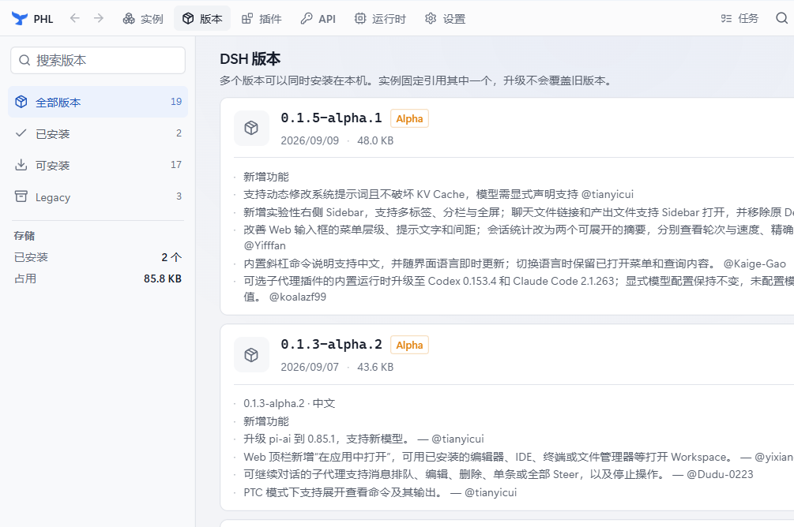
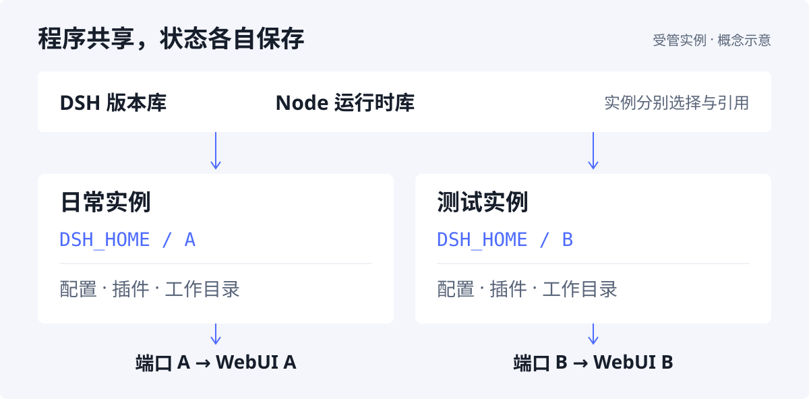

# PHL · DeepSeek Harness 实例与运行时管理器

<p align="center">
  
</p>

在同一台机器上，为日常使用、插件测试和版本尝鲜分别创建 DSH 实例。**每个实例选择自己的 DSH 版本与 Node 运行时，配置、插件和工作目录彼此隔离。**

[下载安装](https://github.com/A7m0spHere/dsh-phl/releases) · [首次运行](#首次运行) · [从源码构建](#从源码构建) · [文档](#文档与反馈) · [问题反馈](https://github.com/A7m0spHere/dsh-phl/issues)

<p align="center">
  
</p>

*桌面端「版本」页实拍。PHL 使用 Tauri 2 + Rust，下载、磁盘读写与进程管理均已接入真实后端。*

## 下载与安装

面向 **Windows 10/11 x64**，目前为 **alpha 预览**，界面与数据格式仍可能变化。PHL 为独立项目，与 DeepSeek 官方无隶属关系。

1. 打开 [Releases](https://github.com/A7m0spHere/dsh-phl/releases)，从最新预览版的 **Assets** 下载 `PHL_<version>_x64-setup.exe` 及同名 `.sha256` 文件。
2. 在下载目录运行下方命令，对照 `.sha256` 核对文件，再运行安装程序。
3. 从开始菜单打开 **PHL**，按下方步骤创建第一个实例。

```powershell
Get-FileHash .\PHL_*_x64-setup.exe -Algorithm SHA256
```

安装包尚未做 Windows 代码签名，首次下载或运行可能出现 SmartScreen 提示，处理步骤见[安装说明](./docs/install-note.md)。应用依赖 WebView2；若系统缺失，安装器会按 [Tauri 默认方式](https://v2.tauri.app/distribute/windows-installer/#webview2-installation-options)联网下载并安装。

**应用内更新：** alpha.3 起可在「设置 → 关于」检查更新、下载并安装。alpha.2 及更早版本需先手动安装带更新功能的版本，详见[更新说明](./docs/auto-update.md)。

## 首次运行

1. **准备 DSH 版本** — 在「版本」页下载所需版本。
2. **准备运行时** — 在「运行时」页下载 Node，或使用已检测到的系统 Node。
3. **创建实例** — 填写名称，选择 DSH 版本、运行时与端口，完成向导。
4. **启动并打开 WebUI** — 在实例页点击「启动」，等待端口就绪；需要插件时，在「插件」页选择目标实例后安装。

已有本机 DSH 环境，可以使用[本机发现与接入](./docs/p0-local-dsh-adoption.md)，按向导选择接入方式及需要迁移的对话。

## 围绕实例管理环境

| 你要做的事 | PHL 提供的能力 |
|---|---|
| 同时保留多个环境 | 创建、克隆与管理实例；各自绑定 DSH 版本和 Runtime，配置与插件独立保存 |
| 下载版本与安装插件 | DSH / Node 下载、完整性校验、进度与取消；插件安装到选定实例 |
| 启动并排查问题 | 端口探测与自动分配、启动日志、崩溃反馈；停止时终止进程树 |
| 修改前留一份备份 | 创建、回滚与删除快照；快照保存实例的 `dsh-home`，不包含 workspace、日志或版本绑定 |
| 接入与迁移环境 | 本机 DSH 发现、对话复制、`.phlpack` 导入导出，以及轻量 Bundle 配置清单 |
| 整理与维护 | 磁盘占用统计、孤立目录与缓存清理、诊断、数据目录迁移和任务中心 |

**Bundle 的范围：** JSON 清单记录实例配置与插件信息，不包含插件文件，也不导出凭据值及机器本地环境变量；导入后需重新安装插件并配置凭据。对话与 `.phlpack` 的迁移范围见[迁移说明](./docs/p1-session-pack.md)。

## 隔离如何工作

<p align="center">
  
</p>

**共享程序文件，分别保存实例状态。** DSH 与 Node 存放在版本库和运行时库中，实例按 ID 引用；配置与插件则放在各自的 `dsh-home`。此处的隔离指环境与数据目录分离，不是操作系统级安全沙箱。

```text
<数据目录>/
├── versions/                   DSH 版本文件
├── runtimes/                   Node 运行时文件
└── instances/<实例 ID>/
    ├── instance.json           版本、运行时与端口等配置
    ├── dsh-home/               实例自己的 DSH_HOME
    │   └── profiles/web/       插件与 profile 配置
    ├── workspace/              工作目录
    └── logs/                   启动日志
```

启动时，PHL 注入实例自己的 `DSH_HOME`，使用所选运行时执行 `dsh web --port <端口>`，固定使用 `web` profile。端口就绪后打开 WebUI；关闭应用时会确认仍在运行的实例。

## 从源码构建

前端使用 **React 18 / TypeScript / Vite 6**，样式与交互由 Tailwind CSS、Motion 和 Zustand 提供。页面统一经过 Repository 接口访问数据，入口在 [`src/services/index.ts`](./src/services/index.ts)。

桌面端构建环境：

| 依赖 | 要求 |
|---|---|
| Node.js | 与项目 CI 一致使用 Node 22，附带 npm |
| Rust | stable，Windows 使用 MSVC 工具链 |
| Visual Studio C++ Build Tools | 安装「使用 C++ 的桌面开发」工作负载 |
| WebView2 | 桌面窗口运行所需 |

克隆仓库后执行：

```bash
git clone https://github.com/A7m0spHere/dsh-phl.git
cd dsh-phl
npm ci
npm run app:dev
```

也可双击 [`run-dev.cmd`](./run-dev.cmd) 检查环境并启动；首次编译 Rust 会花费一些时间。

| 命令 | 用途 |
|---|---|
| `npm run dev` | 浏览器 UI 预览，使用 Mock 数据，不执行真实桌面操作 |
| `npm run app:dev` | 启动 Tauri 桌面应用，连接真实 Rust 后端 |
| `npm run app:build` | 构建 Windows 应用与 NSIS 安装包 |
| `npm run icon` | 从仓库内母版生成应用图标 |

安装包输出到 `src-tauri/target/release/bundle/nsis/`。也可双击 [`build-app.cmd`](./build-app.cmd) 构建并打开产物目录。

<details>
<summary>开发检查与代码导航</summary>

```bash
npm run typecheck
npm run bridge:check
npm test
npm run build
cargo fmt --manifest-path src-tauri/Cargo.toml --all -- --check
cargo clippy --manifest-path src-tauri/Cargo.toml --workspace --all-targets --all-features -- -D warnings
cargo test --manifest-path src-tauri/Cargo.toml --workspace
```

| 目录 | 内容 |
|---|---|
| [`src/pages/`](./src/pages/) / [`src/components/`](./src/components/) | 页面与 UI 组件 |
| [`src/services/`](./src/services/) / [`src/stores/`](./src/stores/) | Repository、桌面桥接与共享状态 |
| [`src/types/`](./src/types/) / [`src/data/`](./src/data/) | 领域模型与浏览器 Mock 数据 |
| [`src-tauri/src/`](./src-tauri/src/) | 下载、实例、插件、运行时、进程与磁盘操作 |
| [`src-tauri/crates/`](./src-tauri/crates/) | 共用 Pack Core 与 `phl-pack` CLI |

开发约定以 [`AGENTS.md`](./AGENTS.md) 为准；完整检查流程见 [CI 配置](./.github/workflows/ci.yml)。

</details>

## 文档与反馈

| 入口 | 内容 |
|---|---|
| [发布记录](https://github.com/A7m0spHere/dsh-phl/releases) | 已发布版本、更新说明与安装包 |
| [应用内更新](./docs/auto-update.md) | 检查更新、下载与安装方式 |
| [本机 DSH 接入](./docs/p0-local-dsh-adoption.md) / [对话与环境迁移](./docs/p1-session-pack.md) | 接入方式、格式与迁移边界 |
| [Pack Core、CLI 与导出 Skill](./docs/p2-pack-core-skill.md) | `.phlpack` 的复用与集成 |
| [安全说明](./SECURITY.md) / [隐私说明](./docs/privacy.md) | 安全边界、漏洞报告与数据处理 |

当前发布与验证重点为 Windows；macOS / Linux 尚未完成真机验收，PHL 内部受管的源码构建管线仍在规划中。

常用快捷键：`Ctrl+K` 快速跳转，`Ctrl+,` 打开设置，`Esc` 返回。完整清单在「设置 → 快捷键」。

遇到问题或有建议，请提交 [Issue](https://github.com/A7m0spHere/dsh-phl/issues)，附上 PHL 版本、复现步骤与相关日志（移除凭据后）。

## 参考与许可

PHL 在产品模型与交互上参考 PCL、Prism Launcher、DSHBox 等项目。实现遵守[代码来源边界](./AGENTS.md#代码来源边界必须遵守)：不复制、移植或机械改写其他 Launcher 的代码，不使用其专有视觉资产。鲸鱼尾鳍标识使用仓库内的独立母版，见[素材来源](./src-tauri/icons/master/PROVENANCE.md)。

[MIT](./LICENSE) © 2026 A7m0spHere · [第三方许可](./THIRD_PARTY_NOTICES.md)
